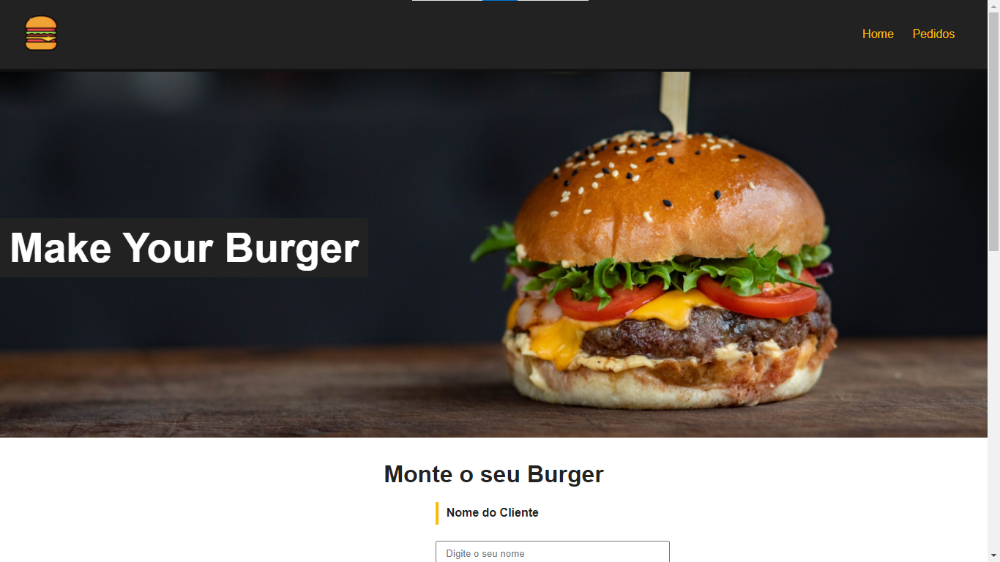
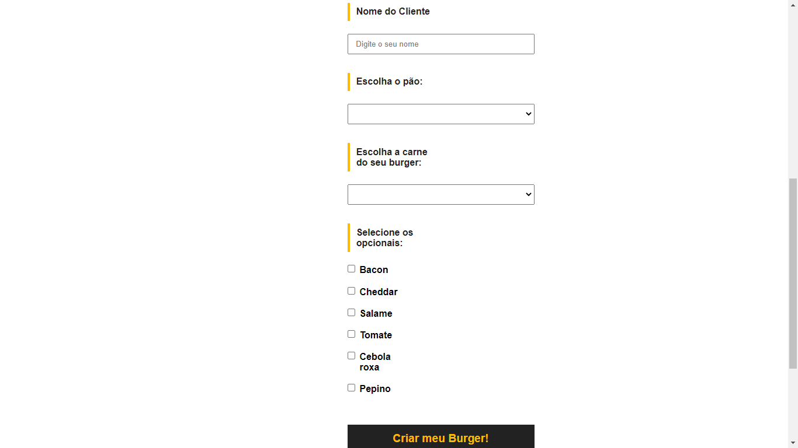
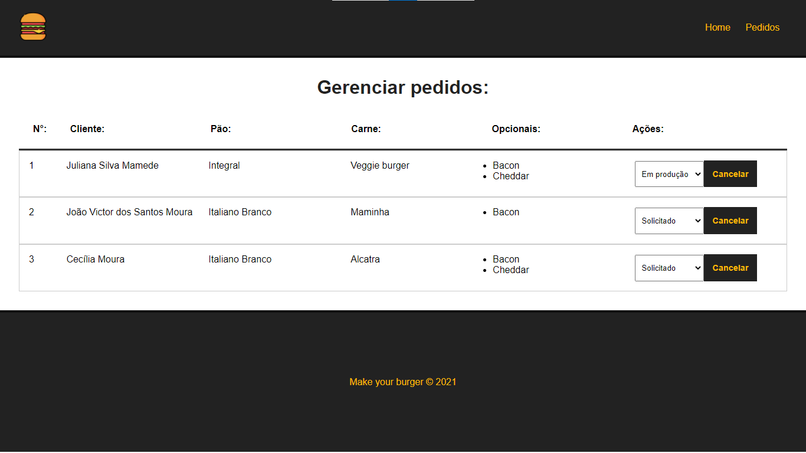

# Burger Store 🍔

This project is an order system for a hamburger restaurant, with an order page and a page to check the orders placed.

📣 This project has been updated to Cypress v13 (with cucumber).

<br>

## Starting this project on your machine

<br>

### Clone the repository

```
git clone https://github.com/jovimoura/burger-store
```

### Go to the directory

```
cd <nome-da-pasta>
```

### Install the dependencies

```
npm install
```

### Start the application (frontend and backend)

#### UNIX / macOS

```
npm start
```

or

```
npm run serve
npm run backend
```

#### Windows

```
npm run start:win
```

This start the backend and frontend.

### The site is at the door

```
http://localhost:8080/
```

## How was it done?

<p>To realize the project, we used Vue-Router, Json-serve, to run a mini database, CSS for styling and JavaScript for project methods and functions!</p>
<p>
The project has two pages, the first page is the home page and the second page is the order page. In the first page we have a form that you will use to assemble your burger and to send the order to the "bank" and in the order part, we have a table that consumes the data from this bank and in the same table we have functions for editing and removing orders.
</p>

## Project Images







## Technologies used

<ul>
    <li>VueJS 3</li>
    <li>Router-link</li>
    <li>Json-serve</li>
    <li>JavaScript</li>
    <li>HTML</li>
    <li>CSS</li>
</ul>

## Author

### João Victor dos Santos Moura

### E-mail: joaovictors.mouraa@gmail.com

### LinkedIn: https://www.linkedin.com/in/jovimoura10/

### Modifying by Nicolas Augereau for Demo with Cypress

[](https://www.linkedin.com/in/nicolasaugereau/)
